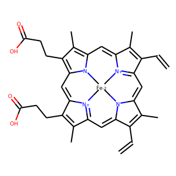
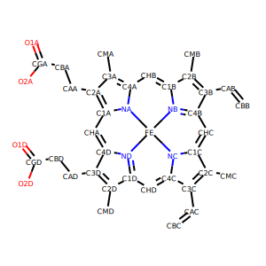

```eval_rst
.. _depictions:
```

# Depictions

The depictions rely on two optional external resources. [PubChem layouts](https://www.ncbi.nlm.nih.gov/pccompound) and general templates for substructures. e.g. [porphyrin rings](https://en.wikipedia.org/wiki/Porphyrin). These can be supplied as a paths to folders with 2D layouts for molecules in an SDF format. If neither of the paths is supplied, `pdbeccdutils` uses a few templates provided with the source code.

```python
from pdbeccdutils.core.depictions import DepictionManager

depictions = DepictionManager('pubchem_templates_dir', 'general_templates_dir')
depiction_result = component.compute_2d(depictions)

rdkit_2d_mol = depiction_result.mol
# Usefull to find out whether or not the drawing is planar or contains clashes.
# Ideally should be 0, but everything < 1 is OK.
score = depiction_result.score

component.export_2d_svg('HEM.svg')
component.export_2d_svg('HEM_names.svg', names=True)
```

---
<div align='center'>
    
    
</div>