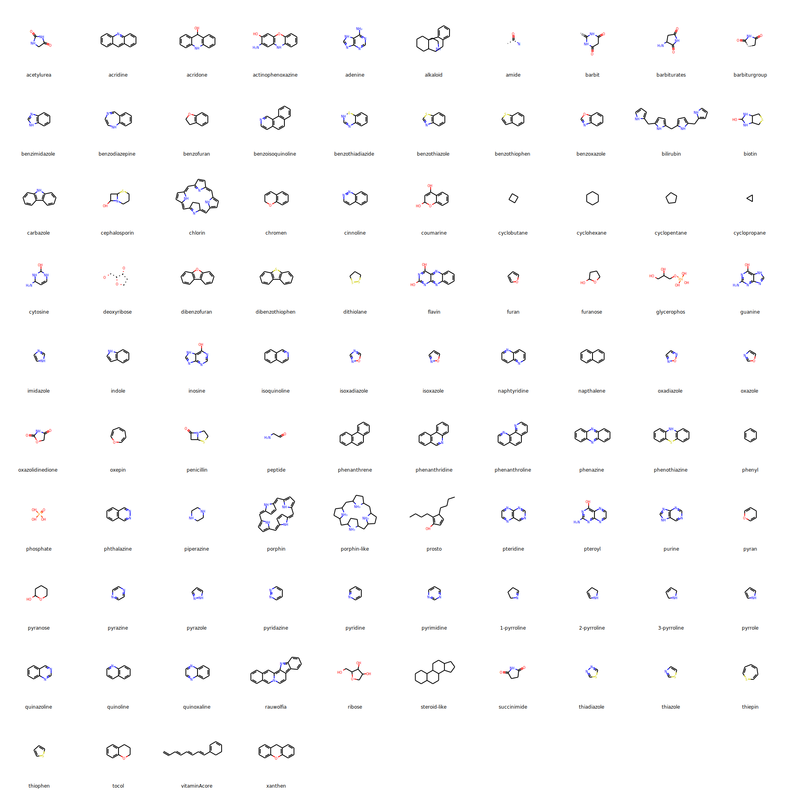

```eval_rst
.. _fragments:
```

# Fragments

`pdbeccdutils` comes with the code to search components using common fragments. Presently, the fragment library contains some ~2k fragments which were manually currated at PDBe and collaborating resources (ENAMINE, DSI). Should you wish to check all the fragments which come with code, please check `pdbeccdutils/data/fragment_library.tsv` file.

Alternativelly fragments can be supplied in an external library (*.tsv) provided the library is formatted accordingly:

|   name	|   kind	|   query	|   description |	comment |   url |	source  |
|-----------|-----------|-----------|---------------|-----------|-------|------------|
|   acetylurea  |   SMILES  |	C1C(=O)NC(=O)N1 |       |   unchecked   |		|PDBe |
| phenanthrene | SMARTS | [#6]1:[#6]:[#6]:[#6]2:[#6](:[#6]:1):[#6]:[#6]:[#6]1:[#6]:2:[#6]:[#6]:[#6]:[#6]:1 | | unchecked | | PDBe |


## Basic use case

```python
from pdbeccdutils.core import ccd_reader
from pdbeccdutils.core.fragment_library import FragmentLibrary

component = ccd_reader.read_pdb_cif_file('HEM.cif').component
fragment_library = FragmentLibrary()

matches = component.library_search(library)
print(f'Matches found in the fragment library {matches}.')

for k, v in component.fragments:
    print(f'Fragment name {k} from source {v.source}')
    print(f'Matches this substructure: {v}')
```

## PDBe supplied fragments

Below you can find actual fragment structures comming with the pdbeccdutil's `FragmentsLibrary` from the PDBe resource:

<div align='center'>
        
</div>