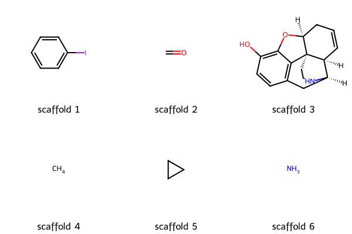
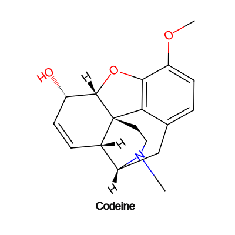

```{eval-rst}
.. _scaffolds:
```
# Scaffolds

`pdbeccdutils` helps to search for scaffolds of small molecules in PDB using RDKit. Presently, the following scaffold identification methods from RDKit are supported: `MurckoScaffold`, `MurckoGeneric`, `Brics`

```python
from pdbeccdutils.core import ccd_reader
from pdbeccdutils.core.models import ScaffoldingMethod
from rdkit.Chem import Draw

component = ccd_reader.read_pdb_cif_file('CVV.cif').component
scaffolds = component.get_scaffolds(scaffolding_method=ScaffoldingMethod.Brics)
img = Draw.MolsToGridImage(scaffolds, legends = [f"scaffold {i}" for i in range(1, len(scaffolds)+1)])
img
```
<p float="left">
    
    
</p>

The figure shows the scaffolds identified by pdbeccdutils using the BRICS fragmentation rule for the chemical component CVV when bound to the human kappa opioid receptor (PDB entry 6b73). Interestingly, scaffold 3 is an exact match to the scaffold of Codeine (ChEMBL485), a known analgesic that targets various opioid receptors, and its biological activity is well-documented in ChEMBL. Although the PDB does not contain the structure of Codeine, the shared scaffold between Codeine and CCD component CVV suggests that Codeine may interact with the Human kappa opioid receptor in a similar manner to CVV
